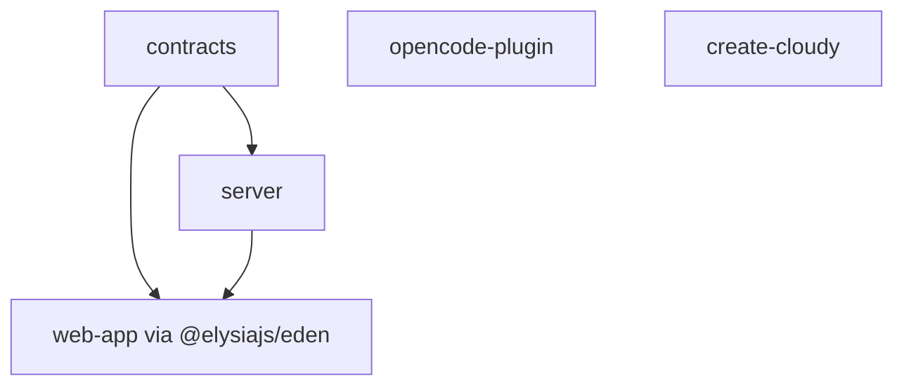

# Cloudy Monorepo

Bun workspace monorepo for Cloudy — AI agent sidekick with chat, ideas, memories, and artifacts.

## Workspace Overview

```
cloudy/
├── apps/
│   ├── server/              # @cloudy/server — Elysia API server
│   └── web-app/             # @cloudy/web-app — React 19 + Vite frontend
├── packages/
│   ├── contracts/           # @cloudy/contracts — Shared TypeScript types
│   ├── opencode-plugin/     # @cloudy/opencode-plugin — OpenCode plugin SDK
│   └── create-cloudy/       # create-cloudy — CLI scaffolding tool
├── tsconfig.json            # Root project references
└── tsconfig.base.json       # Shared TS compiler options
```

## Package Manager

- **Bun** >= 1.3.5 (required)
- Workspace protocol: `workspace:*` for internal deps
- Catalog: `elysia` version pinned via `workspaces.catalog`

## Commands

```bash
bun install                          # Install all workspace deps

bun run dev                          # Dev all apps concurrently
bun run dev:server                   # Dev server only
bun run dev:web-app                  # Dev web-app only
bun run dev:cli                      # Dev/test CLI scaffold tool

bun run lint                         # Lint check (Biome)
bun run lint:write                   # Lint fix (Biome)
bun run format                       # Format (Biome)

bun run clean:modules                # Remove all node_modules + bun.lock
```

## Workspace Dependencies



- `@cloudy/contracts` — shared types consumed by both `server` and `web-app`
- `@cloudy/web-app` uses `@elysiajs/eden` to get type-safe API client from server
- `@cloudy/opencode-plugin` and `create-cloudy` are standalone packages

## Per-Package Details

Each app/package has its own `AGENTS.md` with specific conventions:

| Package | Path | Runtime | Key deps |
|---------|------|---------|----------|
| server | `apps/server/` | Bun + Elysia | elysia, @libsql/client, prisma |
| web-app | `apps/web-app/` | Vite + React 19 | react, zustand, tanstack/router, tiptap, shadcn |
| opencode-plugin | `packages/opencode-plugin/` | Bun | @opencode-ai/plugin |
| contracts | `packages/contracts/` | TypeScript only | @cloudy/server (dev) |
| create-cloudy | `packages/create-cloudy/` | Bun CLI | @clack/prompts, picocolors |

## Adding a New Workspace Package

1. Create directory under `apps/` or `packages/`
2. Add `package.json` with `"name": "@cloudy/<name>"`
3. If it needs shared types, add `"@cloudy/contracts": "workspace:*"` to dependencies
4. Add TypeScript project reference in root `tsconfig.json` if applicable
5. Run `bun install` to link the workspace

## TypeScript

- All packages extend `tsconfig.base.json`
- Root `tsconfig.json` uses project references for `server`, `web-app`, `contracts`
- Strict mode enabled across all packages

## Linting & Formatting

- **Biome** at root level — NOT ESLint (web-app has its own ESLint config)
- Always run `bun run lint:write` before committing server/contracts changes
- For web-app, run `bun run lint --fix` inside `apps/web-app/`

## Testing

| Package | Runner | Command |
|---------|--------|---------|
| server | `bun:test` | `bun test` (inside apps/server) |
| web-app | `vitest` | `bun test` (inside apps/web-app) |
| opencode-plugin | `bun:test` | `bun test` (inside packages/opencode-plugin) |
| create-cloudy | manual | `bun run test:cli` (from root or package) |

## Docker

- `Dockerfile` and `docker-compose.yml` at root
- Server runs migrations on startup via `entrypoint.sh`
- Database volume: `./data:/app/apps/server/data`

## Environment Variables

Copy `.env.example` to `.env`. Key variables:

| Variable | Default | Used by |
|----------|---------|---------|
| `ASSISTANT_AI_BASE_PATH` | `./base-path` | server |
| `OC_API_BASE_PATH` | `http://localhost:4096` | server |
| `DB_DATA_DIR` | `./data` | server |
| `DB_DATABASE_URL` | `file:./data/local.db` | server |

## Ports

| Service | Port |
|---------|------|
| API server | 3000 |
| Web app | 3001 |
| OpenCode API (external) | 4096 |
